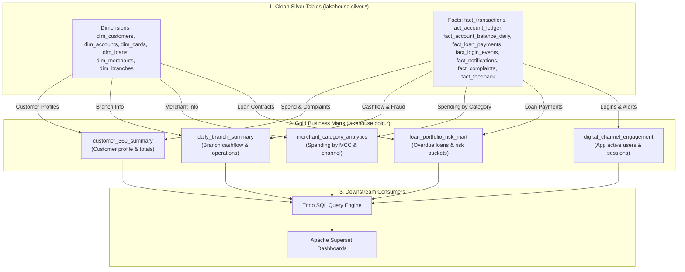
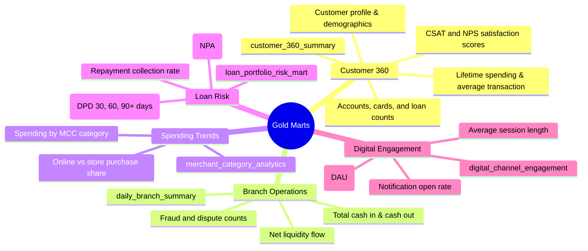

# Gold Layer (Curated Business Marts)

This document describes the **Gold Layer** of the Banking Lakehouse Platform. The Gold layer aggregates and combines clean Silver tables into business-ready data marts for BI dashboards (Apache Superset) and SQL queries (Trino).

For the upstream dimensional model, see [`silver.md`](./silver.md).

---

## 1. Role & Architecture

The Gold layer is our **consumption layer**. It prepares pre-calculated metrics so queries run fast without complex joins.



---

## 2. Business Marts Overview



---

## 3. Gold Table Specifications

All Gold tables belong to catalog namespace **`lakehouse.gold`**.

### 3.1 `gold.customer_360_summary`
Combines customer demographics, accounts, spending, and service feedback into a single customer profile.

- **Sources**: `dim_customers`, `dim_accounts`, `dim_cards`, `dim_loans`, `fact_transactions`, `fact_complaints`, `fact_feedback`.
- **Primary Key**: `customer_id`
- **Transformation Job**: [`gold_customer_360.py`](../../pipeline/jobs/gold/gold_customer_360.py)
- **Write Mode**: `MERGE` (upsert on `customer_id`)

#### Key Metrics:
- $\text{lifetime\_spend\_amount} = \sum \text{amount (debits)}$
- $\text{avg\_ticket\_size} = \frac{\text{lifetime\_spend\_amount}}{\text{lifetime\_txn\_count}}$
- $\text{recency\_days} = \text{datediff}(\text{current\_date}(), \text{last\_active\_date})$

#### DDL:
```sql
CREATE TABLE IF NOT EXISTS lakehouse.gold.customer_360_summary (
    customer_id BIGINT,
    cif_number STRING,
    full_name STRING,
    email STRING,
    phone STRING,
    city STRING,
    country STRING,
    date_of_birth DATE,
    gender STRING,
    occupation STRING,
    annual_income DECIMAL(18,2),
    customer_since DATE,
    persona STRING,
    is_active BOOLEAN,
    num_accounts BIGINT,
    num_active_accounts BIGINT,
    num_cards BIGINT,
    num_active_cards BIGINT,
    num_loans BIGINT,
    num_active_loans BIGINT,
    lifetime_txn_count BIGINT,
    lifetime_spend_amount DECIMAL(18,2),
    avg_ticket_size DECIMAL(18,2),
    first_active_date DATE,
    last_active_date DATE,
    recency_days INT,
    total_complaints BIGINT,
    unresolved_complaints BIGINT,
    avg_csat_score DECIMAL(3,2),
    latest_nps_score INT,
    _gold_processed_at TIMESTAMP,
    source_system STRING
)
USING iceberg;
```

---

### 3.2 `gold.daily_branch_summary`
Tracks daily cash movements, liquidity, and fraud events by branch.

- **Sources**: `fact_transactions`, `dim_accounts`, `dim_branches`.
- **Grain**: One record per branch per transaction date `(branch_code, txn_date)`.
- **Partition Key**: `txn_date`
- **Transformation Job**: [`gold_daily_branch_summary.py`](../../pipeline/jobs/gold/gold_daily_branch_summary.py)
- **Write Mode**: `DYNAMIC_OVERWRITE`

#### Key Metrics:
- $\text{total\_inflow\_amount} = \sum \text{amount (where direction = 'CREDIT')}$
- $\text{total\_outflow\_amount} = \sum \text{amount (where direction = 'DEBIT')}$
- $\text{net\_flow\_amount} = \text{total\_inflow\_amount} - \text{total\_outflow\_amount}$
- $\text{fraud\_rate} = \frac{\text{fraud\_txn\_count}}{\text{total\_transactions}}$

#### DDL:
```sql
CREATE TABLE IF NOT EXISTS lakehouse.gold.daily_branch_summary (
    branch_code STRING,
    branch_name STRING,
    region STRING,
    txn_date DATE,
    total_transactions BIGINT,
    total_inflow_amount DECIMAL(18,2),
    total_outflow_amount DECIMAL(18,2),
    total_gross_volume DECIMAL(18,2),
    net_flow_amount DECIMAL(18,2),
    fraud_txn_count BIGINT,
    disputed_txn_count BIGINT,
    fraud_rate DECIMAL(6,4),
    _gold_processed_at TIMESTAMP,
    source_system STRING
)
USING iceberg
PARTITIONED BY (txn_date);
```

---

### 3.3 `gold.merchant_category_analytics`
Analyzes spending habits across merchant industries (MCC) and payment channels.

- **Sources**: `fact_transactions`, `dim_merchants`.
- **Grain**: `(mcc_code, txn_date)`.
- **Partition Key**: `txn_date`

```sql
CREATE TABLE IF NOT EXISTS lakehouse.gold.merchant_category_analytics (
    mcc_code STRING,
    merchant_category STRING,
    txn_date DATE,
    total_transactions BIGINT,
    total_volume DECIMAL(18,2),
    avg_transaction_amount DECIMAL(18,2),
    unique_customers_count BIGINT,
    online_transactions_count BIGINT,
    physical_transactions_count BIGINT,
    online_volume_ratio DECIMAL(5,2),
    _gold_processed_at TIMESTAMP,
    source_system STRING
)
USING iceberg
PARTITIONED BY (txn_date);
```

---

### 3.4 `gold.loan_portfolio_risk_mart`
Monitors overdue loans and repayment performance.

- **Sources**: `fact_loan_payments`, `dim_loans`.
- **Grain**: `(loan_type, as_of_date)`.
- **Partition Key**: `as_of_date`

#### Days Past Due (DPD) Buckets:
- **Current**: DPD = 0
- **30-Day Overdue**: $1 \le \text{DPD} \le 30$
- **60-Day Overdue**: $31 \le \text{DPD} \le 60$
- **90+ Day Overdue (NPA)**: $\text{DPD} > 90$
- $\text{collection\_efficacy} = \frac{\text{total\_emi\_collected}}{\text{total\_emi\_billed}}$

#### DDL:
```sql
CREATE TABLE IF NOT EXISTS lakehouse.gold.loan_portfolio_risk_mart (
    loan_type STRING,
    as_of_date DATE,
    active_loan_count BIGINT,
    total_sanctioned_amount DECIMAL(18,2),
    total_outstanding_balance DECIMAL(18,2),
    total_emi_billed DECIMAL(18,2),
    total_emi_collected DECIMAL(18,2),
    collection_efficacy DECIMAL(5,2),
    current_loans_count BIGINT,
    delinquent_loans_count BIGINT,
    dpd_30_count BIGINT,
    dpd_60_count BIGINT,
    dpd_90_plus_count BIGINT,
    npa_ratio DECIMAL(5,2),
    _gold_processed_at TIMESTAMP,
    source_system STRING
)
USING iceberg
PARTITIONED BY (as_of_date);
```

---

### 3.5 `gold.digital_channel_engagement`
Tracks how customers use digital banking channels (Mobile App vs Web).

- **Sources**: `fact_login_events`, `fact_notifications`.
- **Grain**: `(channel, event_date)`.
- **Partition Key**: `event_date`

```sql
CREATE TABLE IF NOT EXISTS lakehouse.gold.digital_channel_engagement (
    channel STRING,
    event_date DATE,
    daily_active_users BIGINT,
    total_sessions BIGINT,
    avg_session_duration_seconds INT,
    avg_page_views_per_session DECIMAL(6,2),
    failed_login_count BIGINT,
    biometric_login_ratio DECIMAL(5,2),
    notifications_dispatched BIGINT,
    notifications_opened BIGINT,
    notification_open_rate DECIMAL(5,2),
    _gold_processed_at TIMESTAMP,
    source_system STRING
)
USING iceberg
PARTITIONED BY (event_date);
```

---

## 4. Query Performance

- **Fast Date Filtering**: Partitioned tables (`daily_branch_summary`, `merchant_category_analytics`, `loan_portfolio_risk_mart`, `digital_channel_engagement`) read only the dates requested in queries.
- **File Compaction**: Weekly maintenance jobs run Iceberg `rewrite_data_files` to merge small files into 128MB Parquet files.
- **Storage Location**: Stored in `s3://lakehouse/gold/<table_name>/`.
