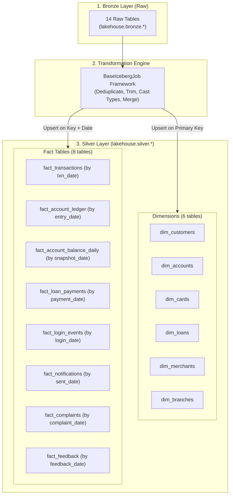
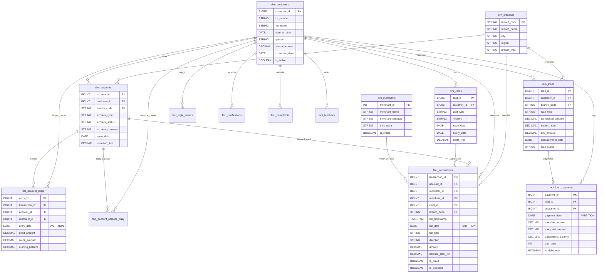
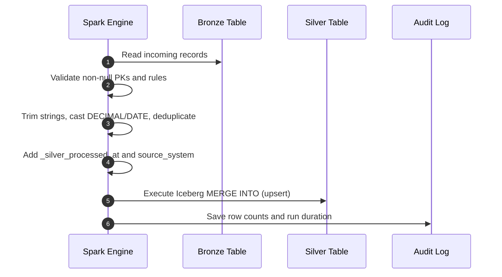

# Silver Layer (Conformed Star Schema)

This document describes the **Silver Layer** of the Banking Lakehouse Platform. The Silver layer cleans the raw Bronze tables, deduplicates records, fixes data types, and structures data into a standard **Star Schema**.

For the original source entities, see [`source.md`](./source.md).

---

## 1. Role & Cleansing Principles

The Silver layer is our **validated and conformed data layer**. It prepares clean dimensions and facts for analytics.



### Core Cleansing Rules:
1. **Accurate Money Values**: All monetary amounts are cast to `DECIMAL(18,2)`. This avoids floating-point rounding errors.
2. **Standard Dates**: Text date strings are converted to standard `DATE` format.
3. **Clean Strings**: Spaces are trimmed, and categorical values (such as `gender`, `channel`, `currency`) are converted to UPPERCASE.
4. **No Duplicates**: Duplicate rows with the same primary key are removed.
5. **Audit Columns**: Every table records `_silver_processed_at (TIMESTAMP)` and `source_system (STRING)`.

---

## 2. Entity-Relationship Diagram (ERD)

The diagram below shows how dimensions and fact tables connect:



---

## 3. Dimension Tables

All Silver tables use catalog namespace **`lakehouse.silver`**.

### 3.1 `silver.dim_customers`
Contains clean customer profiles (SCD Type 1 - in-place update).
- **Source**: `lakehouse.bronze.customers`
- **Primary Key**: `customer_id`
- **Transformation Job**: [`stage_dim_customers.py`](../../pipeline/jobs/silver/stage_dim_customers.py)

```sql
CREATE TABLE IF NOT EXISTS lakehouse.silver.dim_customers (
    customer_id BIGINT,
    cif_number STRING,
    first_name STRING,
    last_name STRING,
    full_name STRING,
    email STRING,
    phone STRING,
    date_of_birth DATE,
    gender STRING,
    marital_status STRING,
    occupation STRING,
    employment_type STRING,
    annual_income DECIMAL(18,2),
    address STRING,
    city STRING,
    state STRING,
    zipcode STRING,
    country STRING,
    lat DOUBLE,
    lon DOUBLE,
    customer_since DATE,
    persona STRING,
    kyc_status STRING,
    is_active BOOLEAN,
    _silver_processed_at TIMESTAMP,
    source_system STRING
)
USING iceberg;
```

---

### 3.2 `silver.dim_accounts`
Contains deposit account information.
- **Source**: `lakehouse.bronze.accounts`
- **Primary Key**: `account_id`
- **Transformation Job**: [`stage_dim_accounts.py`](../../pipeline/jobs/silver/stage_dim_accounts.py)

```sql
CREATE TABLE IF NOT EXISTS lakehouse.silver.dim_accounts (
    account_id BIGINT,
    customer_id BIGINT,
    branch_code STRING,
    account_type STRING,
    account_status STRING,
    account_currency STRING,
    salary_account_flag BOOLEAN,
    open_date DATE,
    account_close_date DATE,
    overdraft_limit DECIMAL(18,2),
    _silver_processed_at TIMESTAMP,
    source_system STRING
)
USING iceberg;
```

---

### 3.3 `silver.dim_cards`
Contains customer card contracts.
- **Source**: `lakehouse.bronze.cards`
- **Primary Key**: `card_id`

```sql
CREATE TABLE IF NOT EXISTS lakehouse.silver.dim_cards (
    card_id BIGINT,
    customer_id BIGINT,
    card_type STRING,
    network STRING,
    issue_date DATE,
    expiry_date DATE,
    card_status STRING,
    primary_card_flag BOOLEAN,
    credit_limit DECIMAL(18,2),
    rewards_program STRING,
    reward_tier STRING,
    _silver_processed_at TIMESTAMP,
    source_system STRING
)
USING iceberg;
```

---

### 3.4 `silver.dim_loans`
Contains retail loan contracts.
- **Source**: `lakehouse.bronze.loans`
- **Primary Key**: `loan_id`

```sql
CREATE TABLE IF NOT EXISTS lakehouse.silver.dim_loans (
    loan_id BIGINT,
    customer_id BIGINT,
    branch_code STRING,
    loan_type STRING,
    sanctioned_amount DECIMAL(18,2),
    interest_rate DECIMAL(6,3),
    tenure_months INT,
    emi_amount DECIMAL(18,2),
    loan_purpose STRING,
    origination_channel STRING,
    loan_status STRING,
    disbursement_date DATE,
    maturity_date DATE,
    _silver_processed_at TIMESTAMP,
    source_system STRING
)
USING iceberg;
```

---

### 3.5 `silver.dim_merchants` & `silver.dim_branches`

```sql
CREATE TABLE IF NOT EXISTS lakehouse.silver.dim_merchants (
    merchant_id INT,
    merchant_name STRING,
    merchant_category STRING,
    mcc_code STRING,
    merchant_type STRING,
    is_online BOOLEAN,
    _silver_processed_at TIMESTAMP,
    source_system STRING
)
USING iceberg;

CREATE TABLE IF NOT EXISTS lakehouse.silver.dim_branches (
    branch_code STRING,
    branch_name STRING,
    city STRING,
    state STRING,
    region STRING,
    branch_type STRING,
    open_date DATE,
    closure_date DATE,
    customer_weight INT,
    _silver_processed_at TIMESTAMP,
    source_system STRING
)
USING iceberg;
```

---

## 4. Fact Tables

### 4.1 `silver.fact_transactions`
Stores cleaned financial transaction events.
- **Source**: `lakehouse.bronze.transactions`
- **Primary Key**: `transaction_id`
- **Partition Key**: `txn_date`
- **Transformation Job**: [`stage_fact_transactions.py`](../../pipeline/jobs/silver/stage_fact_transactions.py)

```sql
CREATE TABLE IF NOT EXISTS lakehouse.silver.fact_transactions (
    transaction_id BIGINT,
    account_id BIGINT,
    customer_id BIGINT,
    received_customer_id BIGINT,
    received_account_id BIGINT,
    merchant_id BIGINT,
    card_id BIGINT,
    branch_code STRING,
    txn_timestamp TIMESTAMP,
    txn_date DATE,
    txn_type STRING,
    direction STRING,
    channel STRING,
    amount DECIMAL(18,2),
    currency STRING,
    transaction_category STRING,
    transaction_description STRING,
    balance_after_txn DECIMAL(18,2),
    is_salary_credit BOOLEAN,
    is_fee BOOLEAN,
    is_reversal BOOLEAN,
    is_fraud BOOLEAN,
    is_disputed BOOLEAN,
    risk_score DECIMAL(5,2),
    device_id STRING,
    ip_address STRING,
    geolocation STRING,
    status STRING,
    _silver_processed_at TIMESTAMP,
    source_system STRING
)
USING iceberg
PARTITIONED BY (txn_date);
```

---

### 4.2 `silver.fact_account_ledger`
Stores double-entry accounting records.
- **Source**: `lakehouse.bronze.account_ledger`
- **Partition Key**: `entry_date`

```sql
CREATE TABLE IF NOT EXISTS lakehouse.silver.fact_account_ledger (
    entry_id BIGINT,
    transaction_id BIGINT,
    account_id BIGINT,
    customer_id BIGINT,
    entry_timestamp TIMESTAMP,
    entry_date DATE,
    entry_type STRING,
    debit_amount DECIMAL(18,2),
    credit_amount DECIMAL(18,2),
    amount DECIMAL(18,2),
    running_balance DECIMAL(18,2),
    reference_number STRING,
    _silver_processed_at TIMESTAMP,
    source_system STRING
)
USING iceberg
PARTITIONED BY (entry_date);
```

---

### 4.3 `silver.fact_account_balance_daily`
Stores end-of-day balances for each account.
```sql
CREATE TABLE IF NOT EXISTS lakehouse.silver.fact_account_balance_daily (
    snapshot_id BIGINT,
    account_id BIGINT,
    customer_id BIGINT,
    snapshot_date DATE,
    snapshot_month STRING,
    end_of_day_balance DECIMAL(18,2),
    is_month_end BOOLEAN,
    _silver_processed_at TIMESTAMP,
    source_system STRING
)
USING iceberg
PARTITIONED BY (snapshot_date);
```

---

### 4.4 `silver.fact_loan_payments`
Stores monthly loan repayment records and overdue days (DPD).
```sql
CREATE TABLE IF NOT EXISTS lakehouse.silver.fact_loan_payments (
    payment_id BIGINT,
    loan_id BIGINT,
    customer_id BIGINT,
    payment_date DATE,
    emi_due_amount DECIMAL(18,2),
    emi_paid_amount DECIMAL(18,2),
    principal_paid DECIMAL(18,2),
    interest_paid DECIMAL(18,2),
    outstanding_balance DECIMAL(18,2),
    dpd_days INT,
    loan_status STRING,
    is_delinquent BOOLEAN,
    _silver_processed_at TIMESTAMP,
    source_system STRING
)
USING iceberg
PARTITIONED BY (payment_date);
```

---

### 4.5 Telemetry & Customer Experience Facts

```sql
CREATE TABLE IF NOT EXISTS lakehouse.silver.fact_login_events (
    session_id BIGINT,
    customer_id BIGINT,
    login_timestamp TIMESTAMP,
    login_date DATE,
    channel STRING,
    device_type STRING,
    session_duration_seconds INT,
    page_views INT,
    logout_type STRING,
    is_successful BOOLEAN,
    failed_attempt_count INT,
    otp_used BOOLEAN,
    biometric_used BOOLEAN,
    _silver_processed_at TIMESTAMP,
    source_system STRING
)
USING iceberg
PARTITIONED BY (login_date);

CREATE TABLE IF NOT EXISTS lakehouse.silver.fact_notifications (
    notification_id BIGINT,
    customer_id BIGINT,
    sent_at TIMESTAMP,
    sent_date DATE,
    channel STRING,
    notification_type STRING,
    opened BOOLEAN,
    opened_at TIMESTAMP,
    _silver_processed_at TIMESTAMP,
    source_system STRING
)
USING iceberg
PARTITIONED BY (sent_date);

CREATE TABLE IF NOT EXISTS lakehouse.silver.fact_complaints (
    complaint_id BIGINT,
    customer_id BIGINT,
    complaint_date DATE,
    channel STRING,
    category STRING,
    severity STRING,
    resolution_days INT,
    resolved_flag BOOLEAN,
    escalated_flag BOOLEAN,
    csat_score INT,
    status STRING,
    _silver_processed_at TIMESTAMP,
    source_system STRING
)
USING iceberg
PARTITIONED BY (complaint_date);

CREATE TABLE IF NOT EXISTS lakehouse.silver.fact_feedback (
    feedback_id BIGINT,
    customer_id BIGINT,
    feedback_date DATE,
    survey_channel STRING,
    survey_topic STRING,
    nps_score INT,
    csat_score INT,
    _silver_processed_at TIMESTAMP,
    source_system STRING
)
USING iceberg
PARTITIONED BY (feedback_date);
```

---

## 5. Job Execution & Safe Upserts

Silver jobs inherit from [`BaseIcebergJob`](../../pipeline/common/base_job.py):



### Partition-Pruned Upsert Example:
When upserting into `fact_transactions`, we match on both `transaction_id` and `txn_date`:

```sql
MERGE INTO lakehouse.silver.fact_transactions AS target
USING staged_cleaned_transactions AS source
ON target.transaction_id = source.transaction_id
   AND target.txn_date = source.txn_date
WHEN MATCHED THEN
  UPDATE SET *
WHEN NOT MATCHED THEN
  INSERT *;
```
Because `txn_date` is included in the `ON` condition, Iceberg only scans the relevant date partitions instead of the whole table.
