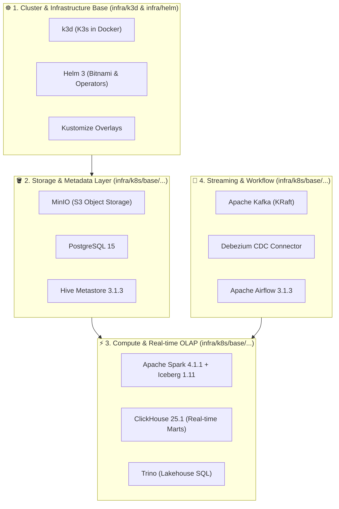

# Hướng Dẫn Vận Hành Công Cụ Hạ Tầng (Infra Tools Guide by Tech Stack)

Tài liệu này tổng hợp chi tiết hướng dẫn sử dụng các công cụ, kịch bản (scripts), Docker images, và Kubernetes manifests nằm trong thư mục [`infra/`](../../infra/), được phân loại cụ thể theo từng ngăn xếp công nghệ (**Technology Stack**).

---



---

## 1. Kubernetes & Cluster Orchestration (`infra/k3d/`, `infra/helm/`)

### 1.1. Công cụ & Thành phần
- **k3d (`infra/k3d/config.yaml`)**: Tạo cụm Kubernetes ảo chạy trên Docker (1 Server node + 2 Agent nodes + LoadBalancer).
- **Cluster Bootstrap Script (`infra/k3d/cluster-dev.sh`)**: Script khởi tạo toàn bộ cụm k3d, mount volume lưu trữ và tự động bind IP host.
- **Helm Installer (`infra/helm/install-dev.sh`)**: Cài đặt các Chart bên ngoài (Bitnami PostgreSQL, MinIO, Spark on K8s Operator).

### 1.2. Lệnh vận hành chính
```bash
# Khởi động cụm k3d và deploy Dev Stack
make up
# hoặc chạy trực tiếp script:
bash infra/k3d/cluster-dev.sh

# Xóa cụm k3d và giải phóng tài nguyên
make down

# Kiểm tra trạng thái toàn bộ pods trên cụm
make status
# hoặc:
kubectl get pods -A
```

---

## 2. Workflow Orchestration (`infra/k8s/base/airflow/`, `infra/docker/airflow/`)

### 2.1. Công nghệ: Apache Airflow 3.1.3
- **Kiến trúc**: Decoupled Microservices chạy trên Kubernetes:
  - `airflow-webserver` (`airflow api-server` port `8088`).
  - `airflow-scheduler` (quét DAGs và điều phối task).
  - `airflow-triggerer` (xử lý Async/Deferrable Operators).
  - `airflow-init` (K8s Job migrate metadata DB `airflow db migrate`).
- **Remote Logging**: Tự động ghi và đọc log trực tiếp qua MinIO S3 (`s3://lakehouse/airflow-logs/`).
- **RBAC**: `airflow-sa` ServiceAccount + ClusterRole cho phép tạo worker pods động (`KubernetesExecutor`).

### 2.2. Danh mục Files
- [`infra/docker/airflow/Dockerfile`](../../infra/docker/airflow/Dockerfile): Custom image chứa providers `cncf-kubernetes`, `apache-spark`, `amazon`, `postgres`, `pyiceberg`.
- [`infra/k8s/base/airflow/rbac.yaml`](../../infra/k8s/base/airflow/rbac.yaml): Quyền Kubernetes API cho Airflow.
- [`infra/k8s/base/airflow/configmap.yaml`](../../infra/k8s/base/airflow/configmap.yaml): Cấu hình S3 logging, timeout, connections.
- [`infra/k8s/base/airflow/deployment.yaml`](../../infra/k8s/base/airflow/deployment.yaml): Deployments độc lập cho 3 dịch vụ.

### 2.3. Lệnh vận hành
```bash
# 1. Build Custom Airflow Image
make build-airflow

# 2. Import image vào k3d
make import-airflow

# 3. Deploy Airflow Stack
make deploy-airflow

# 4. Xem logs Airflow
make logs-airflow

# 5. Port-forward UI Airflow lên máy host
kubectl port-forward svc/airflow-webserver -n airflow 8088:8088
# Truy cập: http://localhost:8088 (User: admin / Pass: admin)

# 6. Test chạy DAG trực tiếp trong Scheduler pod
kubectl exec -n airflow pod/<airflow-scheduler-pod-name> -- airflow dags test banking_lakehouse_pipeline
```

---

## 3. Real-Time OLAP & Data Serving (`infra/k8s/base/clickhouse/`)

### 3.1. Công nghệ: ClickHouse 25.1
- **Vai trò**: Real-time Analytics Engine, Serving Layer cho các Data Marts tốc độ cao, xử lý hàng triệu transactions/giây.
- **Tích hợp Lakehouse**: Hỗ trợ đọc ghi S3/MinIO qua Named Collection `s3_lakehouse` và Iceberg Table Engine.

### 3.2. Danh mục Files
- [`infra/k8s/base/clickhouse/configmap.yaml`](../../infra/k8s/base/clickhouse/configmap.yaml): Mở cổng `8123` (HTTP), `9000` (Native TCP), `9004` (MySQL wire), cấu hình MinIO S3 endpoints.
- [`infra/k8s/base/clickhouse/statefulset.yaml`](../../infra/k8s/base/clickhouse/statefulset.yaml): StatefulSet ClickHouse 25.1 với PVC `local-path`.
- [`infra/k8s/base/clickhouse/job-init-schema.yaml`](../../infra/k8s/base/clickhouse/job-init-schema.yaml): Tự động khởi tạo database `analytics` và các bảng `realtime_transactions`, `daily_account_balances`, `fraud_risk_alerts`.

### 3.3. Lệnh vận hành
```bash
# 1. Deploy ClickHouse
make deploy-clickhouse

# 2. Truy cập CLI tương tác trực tiếp
make cli-clickhouse

# 3. Xem logs ClickHouse
make logs-clickhouse

# 4. Port-forward API ClickHouse
kubectl port-forward svc/clickhouse -n clickhouse 8123:8123 9000:9000

# 5. Chạy truy vấn SQL mẫu
kubectl exec -it -n clickhouse clickhouse-0 -- clickhouse-client --user admin --password clickhouse123 --query "SELECT * FROM analytics.realtime_transactions LIMIT 10;"
```

---

## 4. Lakehouse Storage & Central Catalog (`infra/k8s/base/minio/`, `infra/k8s/base/hive/`, `infra/k8s/base/postgres/`)

### 4.1. Công nghệ: MinIO, Hive Metastore 3.1.3, PostgreSQL 15
- **MinIO**: S3-compatible Object Storage lưu trữ các tầng Medallion (`raw`, `processed`, `curated`, `warehouse`, `lakehouse`).
- **Hive Metastore (HMS)**: Quản lý catalog và schema cho Apache Iceberg / Spark (Thrift protocol port `9083`).
- **PostgreSQL**: Lưu trữ metadata của HMS, Airflow, Superset và Core Banking source database.

### 4.2. Danh mục Files
- [`infra/docker/hive/Dockerfile`](../../infra/docker/hive/Dockerfile): Custom HMS 3.1.3 + PostgreSQL JDBC Driver + Hadoop AWS S3A.
- [`infra/k8s/base/minio/job-init-buckets.yaml`](../../infra/k8s/base/minio/job-init-buckets.yaml): Khởi tạo tự động các S3 buckets chuẩn Lakehouse.
- [`infra/k8s/base/postgres/configmap.yaml`](../../infra/k8s/base/postgres/configmap.yaml): Script SQL tự động tạo các database `metastore`, `airflow`, `superset`, `banking`.

### 4.3. Lệnh vận hành
```bash
# Build & import image Hive Metastore
make build-hive
make import-hive

# Xem logs các thành phần
make logs-minio
make logs-postgres
make logs-hive

# Port forward MinIO Console
kubectl port-forward svc/minio -n minio 9001:9001
# Truy cập: http://localhost:9001 (User: admin / Pass: password123)

# Khởi tạo lại toàn bộ schema DB & Buckets S3
make init-data
```

---

## 5. Distributed Batch & Stream Processing (`infra/k8s/base/spark/`, `infra/docker/spark/`, `infra/k8s/jobs/`)

### 5.1. Công nghệ: Apache Spark 4.1.1 + Apache Iceberg 1.11.0
- **Compute Engine**: Chạy Spark on Kubernetes native, tích hợp sẵn AWS SDK v2 Bundle, PostgreSQL Driver, Apache Iceberg Spark Runtime.
- **Catalog Lakehouse**: Khai báo Spark Catalog kết nối đến Hive Metastore và lưu dữ liệu Iceberg vào MinIO S3A.

### 5.2. Danh mục Files
- [`infra/docker/spark/Dockerfile`](../../infra/docker/spark/Dockerfile): Custom Spark 4.1.1 image với toàn bộ runtime JARs.
- [`infra/k8s/base/spark/configmap.yaml`](../../infra/k8s/base/spark/configmap.yaml): Cấu hình `spark-defaults.conf` (Iceberg extensions, HMS URI, S3A timeouts).
- [`infra/k8s/jobs/job-spark-read-postgres.yaml`](../../infra/k8s/jobs/job-spark-read-postgres.yaml): Mẫu K8s Job đọc dữ liệu từ Postgres qua JDBC.
- [`infra/k8s/jobs/job-spark-write-iceberg.yaml`](../../infra/k8s/jobs/job-spark-write-iceberg.yaml): Mẫu K8s Job ghi bảng ACID Iceberg vào MinIO.

### 5.3. Lệnh vận hành
```bash
# Build & import custom Spark image
make build-spark
make import-spark

# Chạy thử Spark Job: Đọc PostgreSQL Banking Tables
make run-job-postgres

# Chạy thử Spark Job: Ghi dữ liệu vào bảng Apache Iceberg (MinIO)
make run-job-iceberg
```

---

## 6. CDC Ingestion & Event Streaming (`infra/k8s/base/kafka/`, `infra/k8s/base/debezium/`)

### 6.1. Công nghệ: Apache Kafka (KRaft Mode) & Debezium Connect
- **Kafka**: Message Broker lưu trữ luồng sự kiện giao dịch (Transaction Events), chạy chế độ KRaft loại bỏ hoàn toàn ZooKeeper để tiết kiệm RAM.
- **Debezium**: Bắt các thay đổi từ PostgreSQL WAL (`wal_level=logical`) và đẩy ngay lập tức vào Kafka topics.

### 6.2. Lệnh vận hành
```bash
# Deploy Kafka & Debezium
kubectl apply -k infra/k8s/base/kafka
kubectl apply -k infra/k8s/base/debezium

# Đăng ký Debezium PostgreSQL Connector
bash scripts/init/05-init-debezium-connector.sh

# Kiểm tra danh sách Kafka Topics
kubectl exec -n kafka kafka-0 -- /opt/kafka/bin/kafka-topics.sh --bootstrap-server localhost:9092 --list
```

---

## 7. Lakehouse Interactive Query Engine (`infra/k8s/base/trino/`)

### 7.1. Công nghệ: Trino SQL Engine
- **Vai trò**: Cung cấp giao diện truy vấn chuẩn ANSI-SQL tốc độ cao trực tiếp trên các bảng Apache Iceberg và Hive Metastore.

### 7.2. Lệnh vận hành
```bash
# Deploy Trino
kubectl apply -k infra/k8s/base/trino

# Port forward Trino Web UI / CLI
kubectl port-forward svc/trino -n trino 8080:8080

# Truy vấn Trino CLI
kubectl exec -it -n trino deployment/trino -- trino --server localhost:8080 --catalog lakehouse
```

---

## 8. Bảng Tra Cứu Toàn Bộ Lệnh Makefile (`infra/Makefile`)

| Lệnh Make | Mục Đích |
| :--- | :--- |
| `make up` | Khởi tạo cụm k3d và deploy Dev Stack |
| `make down` | Xóa cụm k3d và giải phóng tài nguyên |
| `make build-all` | Build tất cả custom Docker images (Spark, Hive, Airflow) |
| `make import-all` | Import tất cả images vào k3d cluster |
| `make deploy-lakehouse` | Triển khai Dev Overlay (Postgres, MinIO, Hive, Spark, Airflow, ClickHouse) |
| `make deploy-airflow` | Triển khai riêng phân hệ Airflow 3.1.3 |
| `make deploy-clickhouse`| Triển khai riêng phân hệ ClickHouse 25.1 |
| `make cli-clickhouse` | Mở ClickHouse Interactive CLI |
| `make status` | Xem trạng thái pods trên toàn bộ namespaces |
| `make logs-airflow` | Xem stream logs của Airflow pods |
| `make logs-clickhouse` | Xem stream logs của ClickHouse pod |
| `make logs-postgres` | Xem stream logs của PostgreSQL |
| `make logs-minio` | Xem stream logs của MinIO |
| `make logs-hive` | Xem stream logs của Hive Metastore |
| `make run-job-postgres`| Chạy thử Spark Job đọc PostgreSQL |
| `make run-job-iceberg` | Chạy thử Spark Job ghi Apache Iceberg |
