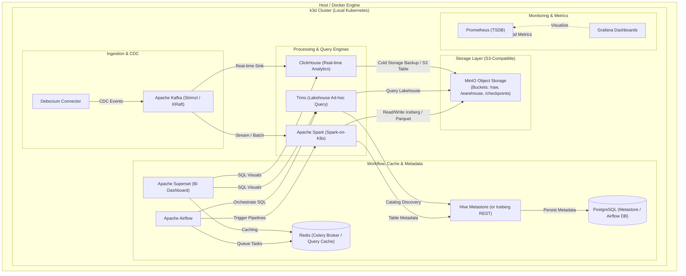

# Modern Cloud-Native Data Lakehouse Platform (k3d + Docker)

Toàn bộ nền tảng Big Data được container hóa 100% và chạy trên **k3d (K3s in Docker)**, sử dụng **MinIO** làm Object Storage chuẩn S3 thay thế hoàn toàn HDFS.

---

## 1. Kiến trúc Tổng quan (Architecture Blueprint)



---

## 2. Danh mục Thành phần & Phân bổ Tài nguyên (16GB RAM / 8 Cores)

Bảng phân bổ Resource Limits/Requests được tinh chỉnh (optimized) để chạy mượt toàn bộ stack trên máy cá nhân 16GB RAM:

| Thành phần | Công nghệ | Request RAM | Limit RAM | Ghi chú tối ưu |
| :--- | :--- | :--- | :--- | :--- |
| **k3d / K8s Core** | K3s + Containerd | 500 MiB | 1 GiB | Đã disable Traefik/Metrics-server thừa |
| **Storage** | MinIO | 256 MiB | 512 MiB | S3 Object Storage thay HDFS |
| **Metadata DB** | PostgreSQL | 256 MiB | 512 MiB | Shared DB cho HMS, Airflow, Superset |
| **Metastore** | Hive Metastore | 512 MiB | 768 MiB | `JAVA_OPTS="-Xmx512m"` |
| **Cache / Broker** | Redis 7 Alpine | 64 MiB | 256 MiB | Cache Superset & Broker Celery Airflow |
| **Streaming** | Apache Kafka | 512 MiB | 1 GiB | Chế độ KRaft (bỏ ZooKeeper), `-Xmx512m` |
| **CDC Connector** | Debezium / Connect | 512 MiB | 768 MiB | Single-task CDC |
| **Batch / ETL** | Apache Spark | 0 MiB | 2 GiB | On-demand (chỉ tốn RAM khi chạy job) |
| **Query Engine** | Trino | 1.5 GiB | 2 GiB | Single node `-Xmx1536m` |
| **Real-time OLAP**| ClickHouse | 512 MiB | 1 GiB | `max_server_memory_usage_to_ram_ratio = 0.3` |
| **Orchestration** | Apache Airflow | 512 MiB | 1 GiB | Webserver + Scheduler (`LocalExecutor`) |
| **BI Visuals** | Apache Superset | 512 MiB | 768 MiB | Gunicorn 2 workers |
| **Monitoring** | Prometheus + Grafana | 384 MiB | 768 MiB | Retention 2 ngày |
| **TỔNG (Baseline khi IDLE)** | | **~5.5 GiB** | **~10-11 GiB** | **Dư 5-6GB cho OS Host & Spark Jobs** |

---

## 3. Cấu trúc Thư mục (Directory Layout)

```
infra/
├── k3d/
│   ├── config.yaml             # Declarative k3d cluster config (ports, storage mounts)
│   └── cluster-dev.sh          # One-shot cluster bootstrap & deploy script
├── helm/
│   ├── install-dev.sh          # Automated Helm installer (Bitnami + Spark Operator)
│   └── values/dev/
│       ├── postgres.yaml       # Bitnami Postgres values
│       ├── minio.yaml          # Bitnami MinIO (Lakehouse S3) values
│       └── spark-operator.yaml # Spark on K8s Operator values
├── docker/
│   └── spark/
│       ├── Dockerfile          # Custom Spark image (Iceberg, S3A, JDBC, Kafka)
│       └── requirements.txt    # Python requirements for PySpark workloads
├── k8s/
│   ├── base/                   # Component base manifests
│   │   ├── postgres/
│   │   ├── minio/
│   │   ├── hive/
│   │   ├── spark/
│   │   ├── kafka/
│   │   ├── debezium/
│   │   ├── trino/
│   │   ├── clickhouse/
│   │   ├── redis/
│   │   ├── airflow/
│   │   ├── superset/
│   │   ├── prometheus/
│   │   └── grafana/
│   └── overlays/
│       └── dev/                # Dev overlay: Postgres + MinIO + Hive + Spark (k3d optimized)
│           └── kustomization.yaml
└── Makefile                    # Developer shortcuts (make up, make down, make status)
```

---

## 4. Hướng dẫn Vận hành & Sử dụng Công cụ theo từng Tech Stack

Chi tiết đầy đủ hướng dẫn xem tại: **[`docs/deployment/infra-tools-guide.md`](../docs/deployment/infra-tools-guide.md)**.

### 4.1. Kubernetes & k3d Cluster (`infra/k3d/`)
- `make up` : Tạo cụm k3d và khởi động stack.
- `make down` : Xóa cụm k3d.
- `make status` : Kiểm tra trạng thái toàn bộ pods (`kubectl get pods -A`).

### 4.2. Apache Airflow 3.1.3 (`infra/k8s/base/airflow/`, `infra/docker/airflow/`)
- `make build-airflow` : Build custom Docker image (`banking/airflow:3.1.3`).
- `make import-airflow` : Import image vào cụm k3d.
- `make deploy-airflow` : Triển khai Airflow (API-server, Scheduler, Triggerer, K8s Executor, S3 Remote Logging).
- `make logs-airflow` : Xem logs Airflow pods.
- `kubectl port-forward svc/airflow-webserver -n airflow 8088:8088` : Mở Web UI tại `http://localhost:8088`.

### 4.3. ClickHouse 25.1 (`infra/k8s/base/clickhouse/`)
- `make deploy-clickhouse` : Triển khai ClickHouse 25.1 và tự động tạo bảng Analytics Marts.
- `make cli-clickhouse` : Mở ClickHouse interactive SQL client.
- `make logs-clickhouse` : Xem logs ClickHouse.
- `kubectl port-forward svc/clickhouse -n clickhouse 8123:8123 9000:9000` : Mở cổng HTTP/Native API.

### 4.4. Apache Spark 4.1.1 & Apache Iceberg 1.11.0 (`infra/k8s/base/spark/`, `infra/docker/spark/`)
- `make build-spark` : Build Docker image Spark 4.1.1 + Iceberg 1.11.0 + AWS SDK v2.
- `make import-spark` : Import image vào k3d.
- `make run-job-postgres` : Chạy Spark Job đọc Core Banking data qua JDBC.
- `make run-job-iceberg` : Chạy Spark Job ghi ACID Iceberg tables vào MinIO.

### 4.5. Storage & Catalog: MinIO, Hive Metastore & PostgreSQL (`infra/k8s/base/minio/`, `infra/k8s/base/hive/`, `infra/k8s/base/postgres/`)
- `make build-hive` / `make import-hive` : Build & import Hive Metastore 3.1.3 image.
- `make logs-minio` / `make logs-postgres` / `make logs-hive` : Xem stream logs từng service.
- `make init-data` : Chạy toàn bộ init scripts (tạo buckets S3, DB schema, HMS).
- `kubectl port-forward svc/minio -n minio 9001:9001` : Mở MinIO Console (`admin` / `password123`).

### 4.6. CDC Streaming & Query: Kafka, Debezium & Trino (`infra/k8s/base/kafka/`, `infra/k8s/base/debezium/`, `infra/k8s/base/trino/`)
- `kubectl apply -k infra/k8s/base/kafka` : Deploy Apache Kafka (KRaft mode).
- `kubectl apply -k infra/k8s/base/debezium` : Deploy Debezium CDC Connector.
- `kubectl apply -k infra/k8s/base/trino` : Deploy Trino Query Engine.
